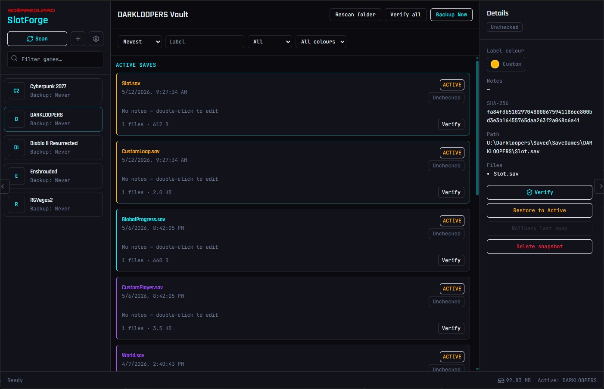
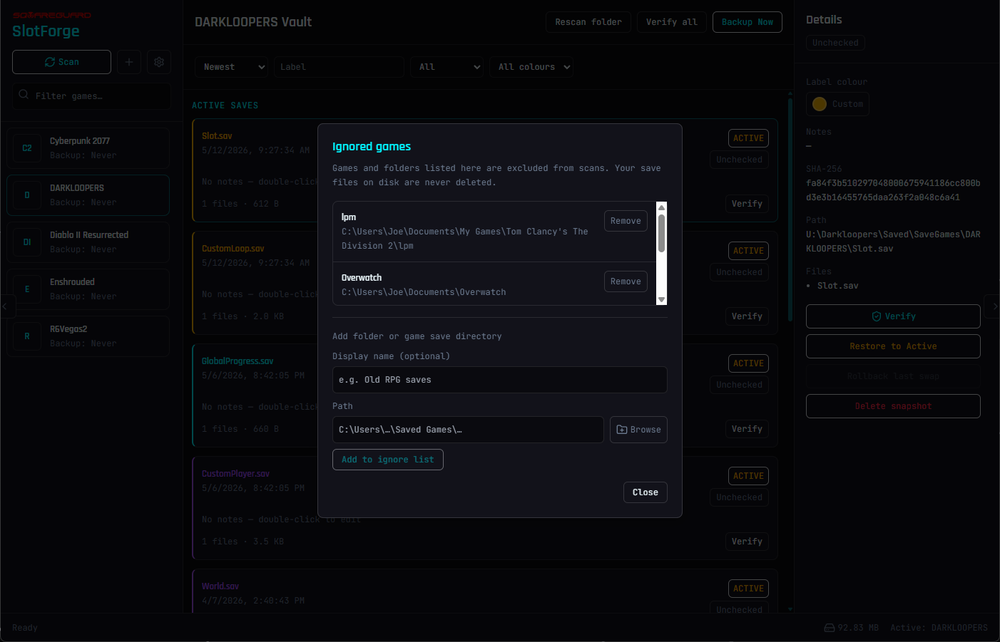
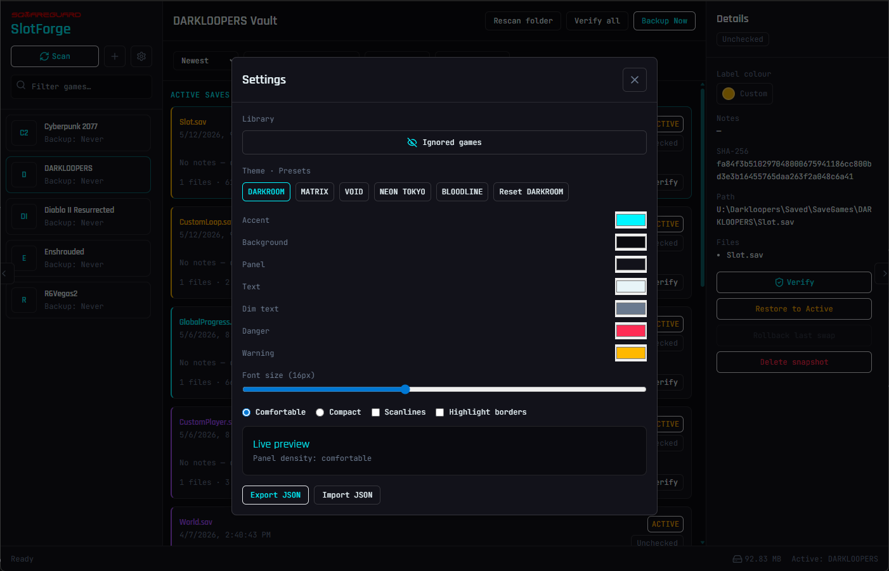

<p align="center">
    
</p>

<h3 align="center">
   SlotForge
</h3>

<p align="center">
   Desktop app for backing up PC game saves, swapping between versions, and keeping everything in one vault on your machine. No cloud, no accounts.
</p>

[](https://github.com/squareguard/SlotForge/actions/workflows/cross-platform-tests.yml)
[](LICENSE)

```
Warning: This project is still in the Pre-Release phase. Please be aware that by using this software in it's current state, you may corrupt and/or lose save files. Please make your own backups. (Yes, I get that defeats the point of it, but it's new software that hasn't been heavily tested by many people yet. Just wanted to warn you...)
```



## More screenshots

<p align="center">
  
  
</p>

## What is SlotForge?

- Scan common save locations (plus paths you add) and track games in a library sidebar
- Back up active saves into a vault, label them, add notes, colour-code cards
- Restore or hot-swap a vault save into the game folder with SHA-256 checks and rollback if something goes wrong
- Ignore games or folders you do not want scanned — nothing on disk is deleted when you add an ignore rule
- Themes and layout tweaks (presets like Darkroom / Matrix, font size, compact mode)

Windows, Linux, and macOS. Data stays local under your config directory and vault path.

## Run from source

You need [Rust](https://rustup.rs/) (stable) and [Node.js](https://nodejs.org/) 18+.

```bash
git clone https://github.com/squareguard/SlotForge.git
cd SlotForge
npm install
npm run tauri:dev
```

The desktop app should then open.

Release build:

```bash
npm run tauri:build
```

Installers land in `src-tauri/target/release/bundle/`.

### CLI only

If you just want the Rust binary and a terminal summary:

```bash
cargo run
```

Optional self-test in a temp dir (PowerShell): `$env:SLOTFORGE_SELF_TEST = "1"; cargo run`

Config defaults to `%APPDATA%\slotforge\config.json` on Windows and `~/.config/slotforge/config.json` elsewhere. Override with `SLOTFORGE_CONFIG_PATH` when developing.

## Development

```bash
cargo test
cargo fmt --all -- --check
cargo clippy --all-targets --all-features -- -D warnings
```

See [CONTRIBUTING.md](CONTRIBUTING.md) for PR flow, project layout, and where to patch things. Security issues: [SECURITY.md](SECURITY.md) (please do not file public issues for vulnerabilities).

Built with **Rust**, **Tauri 2**, and **React** (Vite + Tailwind).

## Contributing & license

Issues and PRs welcome — [contributing guide](CONTRIBUTING.md), [code of conduct](CODE_OF_CONDUCT.md).

[MIT](LICENSE)
