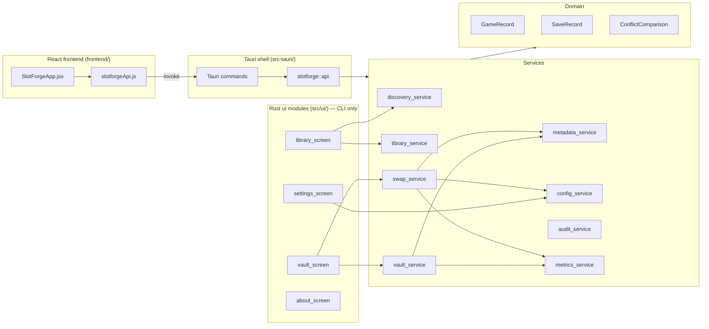

# SlotForge

SlotForge is a cross-platform desktop application for managing PC game save files. It discovers games and save directories, backs up saves to a central vault, annotates them with labels and notes, and supports safe hot-swapping between vault and active game folders—with conflict detection, rollback, and integrity verification.

**Status:** The MVP backend and service layer are implemented in Rust. The **React + Tauri desktop app** connects the UI to real filesystem operations via Tauri IPC commands — no mock API or seed data. The Rust CLI (`cargo run`) remains available for headless diagnostics.

## Features

- **Game discovery** — Scan common OS save locations plus user-defined paths; merge with manually added games.
- **Vault backups** — Copy active saves into a configurable vault (`Documents/SlotForge/Vault` by default on Windows).
- **Annotations** — Friendly labels and notes per save file.
- **Hot swap** — Stage the active save to the vault, copy a vault save into the game directory, verify hashes/metadata, and roll back on failure.
- **Conflict handling** — Compare timestamps and SHA-256 hashes; policies are configurable (prompt, keep both, prefer newer).
- **Safety** — Confirmations for destructive actions, preflight checks (permissions, disk space), audit logging, and MVP metrics.

## Tech stack

### Backend (Rust)

| Area | Technology |
|------|------------|
| Language | [Rust](https://www.rust-lang.org/) (edition 2021) |
| Errors | `anyhow`, `thiserror` |
| Serialization | `serde`, `serde_json` |
| Time | `chrono` |
| Filesystem | `walkdir`, `fs2`, `dirs`, custom `platform::fs` helpers |
| Integrity | `sha2` (SHA-256) |
| Logging | `tracing`, `tracing-subscriber` |
| Async runtime | `tokio` (available for future I/O-heavy work) |
| Persistence | JSON config/registries; `rusqlite` is a dependency for planned SQLite storage |

### Frontend (React)

| Area | Technology |
|------|------------|
| UI library | [React](https://react.dev/) 18 |
| Build tool | [Vite](https://vite.dev/) 6 (`@vitejs/plugin-react`) |
| Styling | [Tailwind CSS](https://tailwindcss.com/) 3, [PostCSS](https://postcss.org/), [Autoprefixer](https://github.com/postcss/autoprefixer) |
| Icons | [lucide-react](https://lucide.dev/) |
| Language | JavaScript (JSX), JSDoc types aligned with Rust domain models |
| Desktop shell | [Tauri](https://tauri.app/) 2 (`@tauri-apps/api`, `tauri-plugin-dialog`) |
| IPC | Tauri commands in `src-tauri/` → `slotforge::api` facade → services |
| Dev server | Port **8000** (embedded in Tauri dev via `tauri dev`) |

The UI is a single self-contained module (`frontend/src/SlotForgeApp.jsx`) with custom components only (no MUI, Chakra, or shadcn). State lives in React (`useReducer` / hooks); there is no `localStorage` or `sessionStorage`. Backend calls go through `frontend/src/api/slotforgeApi.js`.

### CI

| Area | Technology |
|------|------------|
| Pipelines | GitHub Actions matrix on Windows, Linux, and macOS (`cargo fmt`, `clippy`, `test`) |

## Requirements

- **Rust toolchain:** stable (1.70+ recommended). Install from [rustup.rs](https://rustup.rs/), then **open a new terminal** so `cargo` is on your `PATH`. The `tauri:dev` scripts add `~/.cargo/bin` automatically, but Rust must be installed first.
- **Node.js:** 18+ and npm (for the frontend and Tauri tooling).
- **Platforms:** Windows, Linux, macOS (paths and defaults are OS-aware).

## Build

From the repository root:

```bash
cargo build
```

Release binary (optimized):

```bash
cargo build --release
```

The executable is `target/release/slotforge` (or `slotforge.exe` on Windows).

## Desktop app (recommended)

Run SlotForge as a native desktop window with the React UI wired to the Rust backend.

From the repository root (recommended):

```bash
npm install
npm run tauri:dev
```

Or from `frontend/` (delegates to the repo root):

```bash
cd frontend
npm install
npm run tauri:dev
```

This starts the Vite dev server and opens the Tauri shell. All library, vault, backup, restore, verify, and delete actions use real files on disk.

Production desktop build:

```bash
npm run tauri:build
```

(from repo root, or `npm run tauri:build` from `frontend/`)

Installers/binaries are written under `src-tauri/target/release/bundle/`.

## Frontend (web assets only)

The React app is bundled into the Tauri shell. For UI-only development without the desktop window:

```bash
cd frontend
npm install
npm run dev
```

Open [http://localhost:8000](http://localhost:8000). **Note:** Tauri IPC commands are unavailable in the browser-only dev server; use `npm run tauri:dev` for full functionality.

### Production static build

```bash
cd frontend
npm run build
```

Output is written to `frontend/dist/`. Preview locally with `npm run preview`.

## Run locally (Rust CLI)

```bash
cargo run
```

On startup, SlotForge prints a summary of settings, discovered games, vault status, swap readiness, and MVP metrics. On first run, it creates a default config if none exists (vault root, scan paths, conflict policy, safety options).

Optional API exercise in an isolated temp directory (add game, backup, annotate, config mutations):

```bash
# PowerShell
$env:SLOTFORGE_SELF_TEST = "1"
cargo run
```

### Configuration paths

| Item | Default location |
|------|------------------|
| App config | `%APPDATA%\slotforge\config.json` (Windows), `~/.config/slotforge/config.json` (Linux/macOS) |
| Vault | Under user Documents (see `platform::path_defaults`) |
| Audit log | Next to config: `audit.log` |
| Metrics | Next to config: `metrics.json` |
| Manual games | `manual-games.json` in the same config directory |

Override config location for development or tests:

```bash
# PowerShell
$env:SLOTFORGE_CONFIG_PATH = "C:\path\to\config.json"
cargo run

# Bash
export SLOTFORGE_CONFIG_PATH=/path/to/config.json
cargo run
```

## Test and lint

```bash
cargo test
cargo fmt --all -- --check
cargo clippy --all-targets --all-features -- -D warnings
```

CI runs the same checks on `ubuntu-latest`, `windows-latest`, and `macos-latest` (see `.github/workflows/cross-platform-tests.yml`).

## Install

**From source (development):**

```bash
cargo install --path .
```

This installs `slotforge` into `~/.cargo/bin` (ensure that directory is on your `PATH`).

**From a release build:**

Copy `target/release/slotforge` (or `.exe`) to a directory on your `PATH`, or distribute it with your preferred installer (MSI, deb, dmg, etc.). No separate runtime is required beyond the OS.

## Deploy

SlotForge is a single native binary plus JSON data files in the user config directory.

1. Build with `cargo build --release`.
2. Ship the binary for each target triple (`x86_64-pc-windows-msvc`, `x86_64-unknown-linux-gnu`, `aarch64-apple-darwin`, etc.).
3. On first launch, the app writes default `config.json`; users can change vault root and scan paths via the settings layer (or by editing config).
4. Optional: run GitHub Actions on push/PR to validate cross-platform builds before release.

There is no server component; backups and vault data stay on the user's machine.

## Project layout

```
src/
  main.rs              # Entry point → app::run()
  app/                 # Startup, shell navigation state
  domain/              # Game, save, and conflict models
  platform/            # Path normalization, OS default paths
  services/            # Core business logic
  storage/             # Persistence adapters (SQLite stub)
  ui/                  # Rust screen modules (CLI-era navigation; parallel to React UX)
frontend/
  index.html           # HTML shell
  vite.config.js       # Vite + React plugin, port 8000
  src/
    main.jsx           # React entry point
    SlotForgeApp.jsx   # Full UI and components
    api/slotforgeApi.js # Tauri IPC client (invoke commands)
    index.css          # Global styles, theme tokens, animations
  tailwind.config.js
  postcss.config.js
src-tauri/
  tauri.conf.json      # Tauri desktop config
  src/lib.rs           # Tauri command handlers
  capabilities/        # Tauri ACL permissions
  icons/               # App icons
src/api/               # Rust API facade for the UI (DTOs + commands)
tests/fixtures/        # Cross-platform test fixture conventions
.github/workflows/     # CI test matrix (Rust)
```

## Architecture overview



## Main types and functions

### Domain (`src/domain/`)

| Type | Description |
|------|-------------|
| `GameRecord` | A game entry: id, name, `active_save_dir`, optional `game_root`, `GameSource` (auto vs manual), tags, timestamps. |
| `SaveRecord` | A save file: path, `SaveOrigin` (active dir or vault), label/note, `SaveMetadata`, optional `archived_at`. |
| `SaveMetadata` | `modified_at`, `created_at`, `byte_size`, `sha256` hash. |
| `ConflictComparison` | Compares two saves: paths, metadata, `SaveFreshness`, human-readable `reason`. |
| `ResolutionChoice` | User/policy choice: keep source, keep destination, keep both (rename), or cancel. |

### Platform (`src/platform/`)

| Function / module | Description |
|-------------------|-------------|
| `fs::resolve_path` | Expands `%VAR%` / `${VAR}` and normalizes path segments. |
| `fs::ensure_directory` | Creates parent directories as needed. |
| `path_defaults::default_vault_root` | OS-specific default vault directory. |
| `path_defaults::default_scan_paths` | Common “Saved Games” / “My Games” style locations per OS. |

### Services (`src/services/`)

| Module | Key functions | Role |
|--------|---------------|------|
| `config_service` | `ensure_initialized`, `get_conflict_policy`, `set_vault_root`, `add_scan_path` | Load/save `AppConfig` (vault, scan paths, `ConflictPolicy`, `SafetyOptions`). |
| `discovery_service` | `discover_games_from_roots`, `discover_and_merge_library` | Walk scan roots and detect directories containing save-like files. |
| `library_service` | `add_manual_game`, `build_canonical_library` | Persist manual games; dedupe with discovered entries (manual wins). |
| `vault_service` | `backup_active_saves_for_game`, `list_vault_saves_for_game`, `delete_save`, `compare_saves`, `annotate_save` | Vault backup, listing, delete with confirmation, metadata comparison, annotations. |
| `swap_service` | `preflight_check`, `execute_swap_transaction`, `destructive_swap_warning` | Preflight (read/write/space), atomic swap with staging and rollback, conflict resolution. |
| `metadata_service` | `collect_metadata`, `verify_copy_integrity`, `verify_metadata_pair` | SHA-256 and timestamps; post-copy verification. |
| `audit_service` | `init_logging`, `record_event` | Structured audit events to log file and `tracing`. |
| `metrics_service` | `record_operation`, `read_snapshot`, `evaluate_mvp_criteria` | Operation counters and MVP success rates (success, swap/restore failure, recoverability). |

### UI (`src/ui/`)

| Module | Description |
|--------|-------------|
| `navigation` | `AppSection` enum (Library, Vault, Settings, About) and labels. |
| `theme` | `dark_hacker_theme()` — dark-only palette, typography, spacing. |
| `library_screen` | `load_state`, `add_manual_game_action`, filtering/sorting. |
| `vault_screen` | Vault browse, compare, annotate, delete with confirmation phrase. |
| `settings_screen` | Scan paths, vault root, conflict policy updates. |
| `about_screen` | Version, build target, reliability guarantees. |

### Application (`src/app/mod.rs`)

| Type / function | Description |
|-----------------|-------------|
| `AppShellState` | Tracks active nav section; `navigate_to`, `active_section_label`. |
| `run()` | Initializes logging, config, audit startup event, theme, and screen bootstrap. |

## MVP metrics (defaults)

`metrics_service::MvpSuccessCriteria` defines release-style targets:

- Operation success rate ≥ **95%**
- Swap failure rate ≤ **5%**
- Restore failure rate ≤ **5%**
- User-error recoverability ≥ **90%**

Counters are updated when backup, delete, and swap operations run. Use `read_snapshot()` and `evaluate_mvp_criteria()` to inspect readiness.

## License

MIT — see `Cargo.toml`.
